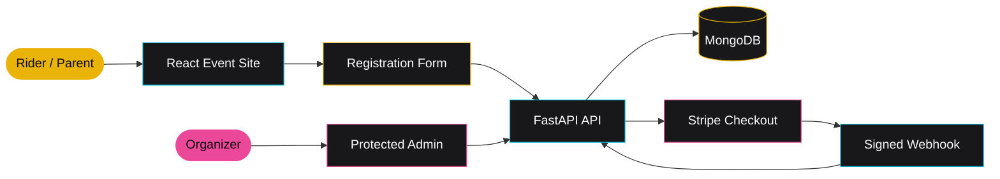

<div align="center">

<pre>
███╗   ███╗ ██████╗ ████████╗ ██████╗
████╗ ████║██╔═══██╗╚══██╔══╝██╔═══██╗
██╔████╔██║██║   ██║   ██║   ██║   ██║
██║╚██╔╝██║██║   ██║   ██║   ██║   ██║
██║ ╚═╝ ██║╚██████╔╝   ██║   ╚██████╔╝
╚═╝     ╚═╝ ╚═════╝    ╚═╝    ╚═════╝
M A Y H E M   R O D E O
</pre>

# RIDE HARD · CAUSE MAYHEM · HAVE FUN

### The official event, registration, payment, and rider-management platform for MOTO Mayhem Rodeo.

[](https://react.dev/)
[](https://fastapi.tiangolo.com/)
[](https://www.mongodb.com/)
[](https://stripe.com/)
[](https://www.docker.com/)

**JULY 25, 2026** · **ED HUGHES MEMORIAL ARENA** · **IONE, CALIFORNIA**

</div>

---

## THIS ISN'T A BROCHURE SITE

MOTO Mayhem is a full-stack event platform built to take a rider from the first hit of the homepage all the way to race-day check-in. It combines a high-energy public site with registration intake, payment infrastructure, event operations, and a protected organizer dashboard.

The visual language comes straight from a race flyer taped to a garage wall: hard edges, oversized type, blacktop-dark surfaces, checkered textures, and flashes of yellow, hot pink, and cyan.

### What is already in the gate

- Six-page public event site with responsive navigation and a live race-day countdown
- Class, schedule, safety, sponsor, contact, and event-detail experiences
- Multi-class rider registration with emergency-contact and shirt-size collection
- Venmo/cash reservation flow in the current registration UI
- Stripe Checkout, payment-status polling, and signed webhook support in the API
- Cookie-based admin authentication with protected routes
- Organizer dashboard with registration totals, paid/pending counts, revenue, and rider management
- Single-container production build where FastAPI serves both the API and compiled React app

---

## THE RACE LINE



| Layer | Built with | Responsibility |
| --- | --- | --- |
| Frontend | React 19, React Router, Tailwind CSS, Framer Motion | Public site, registration, payment result, admin UI |
| API | FastAPI, Pydantic, Uvicorn | Auth, registrations, contact, payments, admin operations |
| Data | MongoDB, Motor | Riders, users, contacts, payment transactions |
| Payments | Stripe Checkout + webhooks | Checkout sessions and payment reconciliation |
| Delivery | Multi-stage Docker build | Compiled React app and API in one deployable image |

---

## START YOUR ENGINES

### Prerequisites

- Node.js 20+
- Python 3.11+
- A MongoDB database
- A Stripe test account if you are exercising card payments

### 1. Clone and enter the garage

```bash
git clone https://github.com/mrnickrushing/moto.git
cd moto
```

### 2. Configure the API

Create `backend/.env`:

```dotenv
MONGO_URL=mongodb://localhost:27017
DB_NAME=moto_mayhem

JWT_SECRET=replace-with-a-long-random-secret
ADMIN_EMAIL=admin@example.com
ADMIN_PASSWORD=replace-with-a-strong-password

FRONTEND_URL=http://localhost:3000
STRIPE_SECRET_KEY=sk_test_replace_me
STRIPE_WEBHOOK_SECRET=whsec_replace_me
```

Install and start the backend:

```bash
python3 -m venv .venv
source .venv/bin/activate
pip install -r backend/requirements-deploy.txt
cd backend
uvicorn server:app --reload --host 0.0.0.0 --port 8000
```

The API will be available at `http://localhost:8000/api/`.

### 3. Launch the frontend

In another terminal, from the repository root:

```bash
cd frontend
yarn install --frozen-lockfile
printf 'REACT_APP_BACKEND_URL=http://localhost:8000\n' > .env.local
yarn start
```

Open `http://localhost:3000` and let it rip.

> Environment files are ignored by Git. Never commit live database credentials, admin passwords, JWT secrets, or Stripe keys.

---

## TRACK MAP

```text
moto/
├── backend/
│   ├── server.py                 # FastAPI app, models, routes, auth, payments
│   ├── setup_stripe.py           # Stripe product/price provisioning helper
│   ├── requirements-deploy.txt   # Minimal production dependencies
│   └── tests/                    # Live API integration tests
├── frontend/
│   ├── public/
│   └── src/
│       ├── components/           # Layout, navigation, motion, countdown, UI kit
│       ├── context/              # Admin auth state
│       ├── data/                 # Event, schedule, classes, sponsors, imagery
│       ├── lib/                  # API client and shared helpers
│       └── pages/                # Public, registration, payment, and admin routes
├── memory/PRD.md                 # Product requirements and backlog
├── design_guidelines.json        # Visual system and interaction direction
└── Dockerfile                    # Production frontend + API image
```

### Public routes

| Route | Purpose |
| --- | --- |
| `/` | Event landing page and countdown |
| `/event` | Schedule, location, rules, and safety |
| `/classes` | Bike and age-class breakdown |
| `/sponsors` | Sponsor wall and sponsor call-to-action |
| `/register` | Rider registration and entry summary |
| `/contact` | General and sponsorship inquiries |
| `/payment/success` | Stripe payment reconciliation result |

### Organizer routes

| Route | Purpose |
| --- | --- |
| `/admin/login` | Organizer authentication |
| `/admin` | Protected registrations and revenue dashboard |

---

## API CHECKPOINTS

All API routes live under `/api`.

<details>
<summary><strong>Public and payment endpoints</strong></summary>

| Method | Endpoint | Purpose |
| --- | --- | --- |
| `GET` | `/api/` | API health/root response |
| `POST` | `/api/registrations` | Create a rider registration |
| `POST` | `/api/contact` | Store a contact inquiry |
| `POST` | `/api/payments/checkout` | Create a Stripe Checkout session |
| `GET` | `/api/payments/status/{session_id}` | Reconcile and return payment state |
| `POST` | `/api/stripe/webhook` | Process signed Stripe events |

</details>

<details>
<summary><strong>Authentication and admin endpoints</strong></summary>

| Method | Endpoint | Purpose |
| --- | --- | --- |
| `POST` | `/api/auth/login` | Start an admin session |
| `GET` | `/api/auth/me` | Resolve the current admin |
| `POST` | `/api/auth/logout` | End the current session |
| `GET` | `/api/admin/stats` | Registration and revenue totals |
| `GET` | `/api/admin/registrations` | List registrations |
| `PATCH` | `/api/admin/registrations/{id}` | Update payment status or notes |
| `DELETE` | `/api/admin/registrations/{id}` | Delete a registration |
| `GET` | `/api/admin/contacts` | List contact inquiries |

</details>

---

## RUN THE CHECKS

Build the frontend:

```bash
cd frontend
yarn install --frozen-lockfile
yarn build
```

Run the backend integration suite:

```bash
pytest backend/tests/backend_test.py
```

The backend tests exercise a running API and create test registrations. Point them at the intended test environment and never run payment tests against live Stripe credentials.

Every pull request and push to `main` runs the deterministic CI checks in `.github/workflows/ci.yml`: a frozen-lockfile frontend production build plus backend compilation and FastAPI import validation. The live API integration suite remains manual because it creates registrations, exercises admin mutations, and reaches Stripe.

---

## SHIP THE MAYHEM

The root `Dockerfile` builds the React frontend, installs the minimal Python runtime, and serves everything from FastAPI on one origin.

```bash
docker build -t moto-mayhem .
docker run --env-file backend/.env -p 8000:8000 moto-mayhem
```

Production must provide MongoDB, JWT, admin, and Stripe configuration through environment variables. The container honors the platform-provided `PORT` value and otherwise listens on `8000`.

---

## NEXT HEAT

- Rider confirmation emails
- CSV registration export
- Per-class capacity limits
- Results and leaderboard page
- Post-event photo gallery
- Sponsor logo uploads

---

<div align="center">

### BUILT FOR DIRT, SPEED, AND A LITTLE BIT OF MAYHEM.

`BLACKTOP #09090B` · `FULL SEND #EAB308` · `HOT PINK #EC4899` · `ELECTRIC CYAN #06B6D4`

</div>
